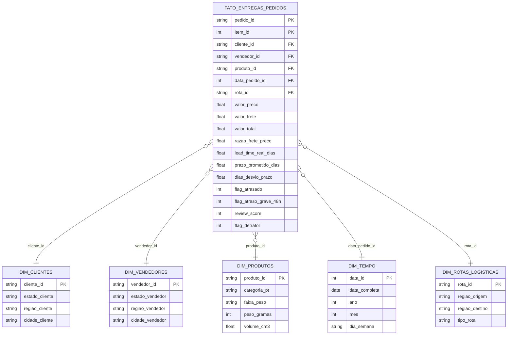
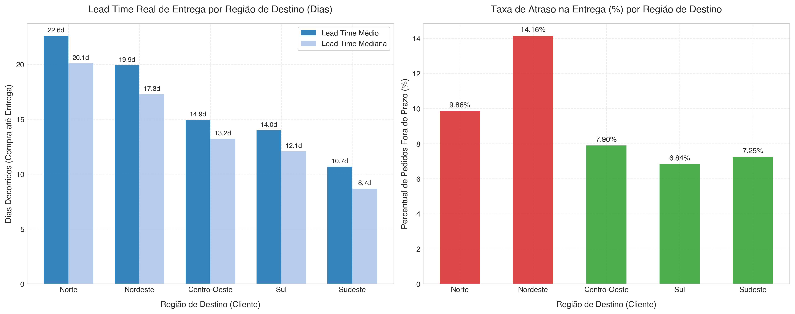
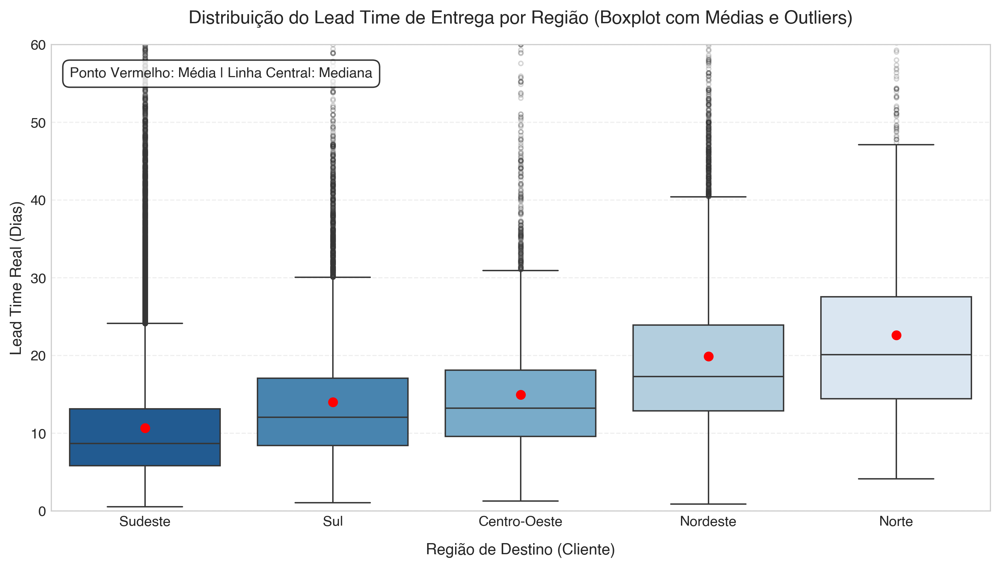
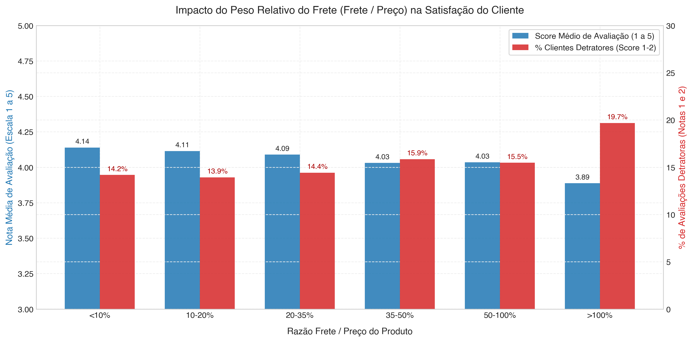
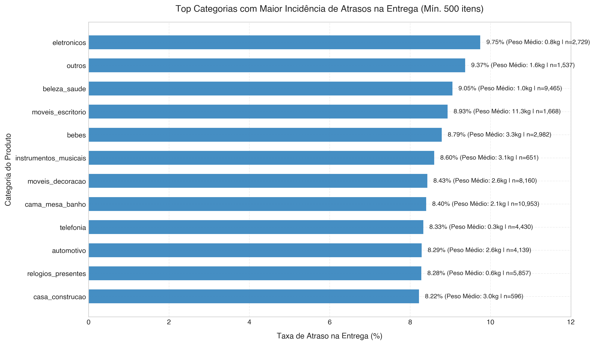
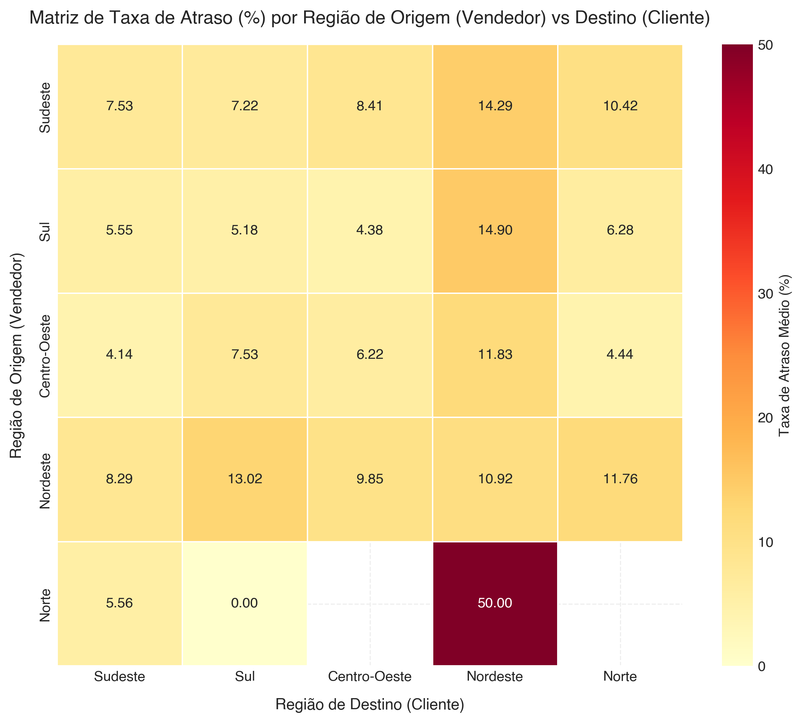
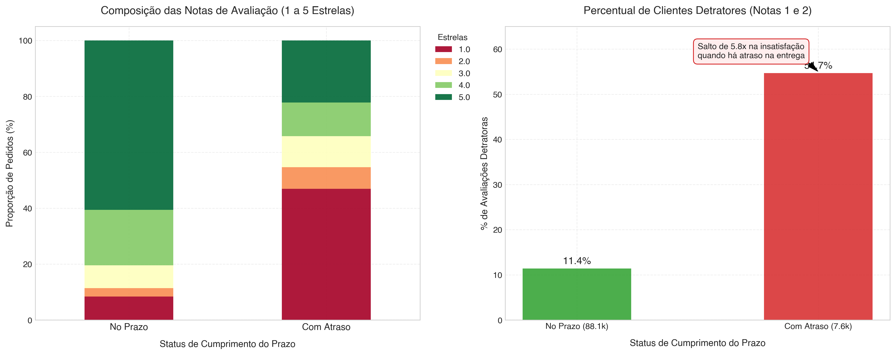
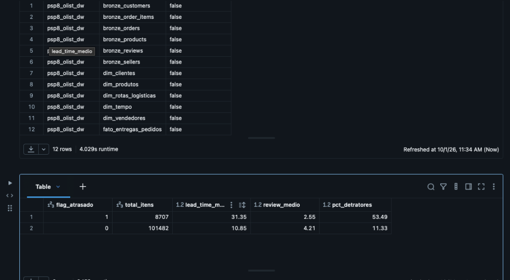

# MVP — Sistema de Apoio à Decisão Logística no E-Commerce Brasileiro
### Otimização de Prazos de Entrega (*Last-Mile*), Custos de Frete e Nível de Serviço (*CSAT*)
**Departamento de Engenharia de Produção — Faculdade de Tecnologia — Universidade de Brasília (UnB)**  
**Disciplina:** Sistemas de Apoio à Decisão (PSP8)  
**Professor Responsável:** Prof. Dr. André Luiz Marques Serrano  
**Autor:** Rodrigo Fregonasse  

[](https://www.python.org/)
[](https://community.cloud.databricks.com/)
[](LICENSE)
[](LICENSE)

---

## Sumário Executivo
Este projeto constitui o **Minimum Viable Product (MVP)** desenvolvido para a disciplina de Sistemas de Apoio à Decisão (PSP8). O trabalho implementa um pipeline de dados analítico ponta a ponta na nuvem (**Databricks / Delta Lake**), estruturado sob a metodologia **KDD (*Knowledge Discovery in Databases*)** e a arquitetura dimensional de **Ralph Kimball (Esquema Estrela)**.

O objetivo central é diagnosticar os gargalos logísticos da cadeia de transporte e entrega final (*last-mile*) no comércio eletrônico brasileiro, quantificando o impacto de prazos, atrasos operacionais e disparidades regionais sobre o nível de serviço e a satisfação do cliente final (*CSAT* e clientes detratores).

---

## 1. Definição do Problema e Objetivos de Negócio

### 1.1 Contexto e Justificativa de Engenharia de Produção
No setor de comércio eletrônico, a etapa de entrega ao consumidor final (*last-mile delivery*) representa entre 40% e 53% do custo logístico total e constitui o principal ponto de contato físico com o cliente. No Brasil, as dimensões continentais, a matriz de transportes prioritariamente rodoviária e a concentração de centros de distribuição (CDs) e polos vendedores no eixo Sul-Sudeste impõem fortes assimetrias na prestação do serviço.

Atrasos nas entregas acarretam perdas financeiras diretas (custos de reentrega, cancelamentos, indenizações e atendimento no SAC) e perdas intangíveis severas na reputação da marca (*churn rate*). Este MVP modela o fenômeno a fim de apoiar gestores de logística e *marketplaces* no redimensionamento de prazos prometidos, na precificação dinâmica de fretes e na priorização de contratos de transporte rodoviário interestadual.

### 1.2 Perguntas de Negócio Norteadoras
Conforme exigido pelo método científico da disciplina, as seguintes 5 perguntas foram formuladas **previamente** à exploração dos dados:

1. **Pergunta 1 (Disparidade Regional):** *Qual é a disparidade no tempo médio real de entrega (lead time) em comparação com a data estimada prometida pela plataforma entre as 5 macrorregiões do Brasil?*
2. **Pergunta 2 (Burden de Frete):** *Em que medida a razão entre o custo do frete e o preço do item (burden logístico) se correlaciona com a ocorrência de atrasos e a avaliação do cliente (review score)?*
3. **Pergunta 3 (Gargalos por Categoria):** *Quais categorias de produtos apresentam maior incidência de entregas fora do prazo prometido, e como peso e cubagem condicionam esse desempenho?*
4. **Pergunta 4 (Tipologia de Rota):** *Qual a relação entre a complexidade da rota logística (intraestadual vs. interestadual na mesma região vs. inter-regional) e a probabilidade de atrasos graves (superiores a 48 horas)?*
5. **Pergunta 5 (Impacto no CSAT & Simulação):** *Qual o impacto direto do atraso na entrega sobre a probabilidade de o cliente emitir uma avaliação detratora (score 1 ou 2), e qual seria a elevação projetada no CSAT geral da plataforma com a redução de 50% dos atrasos?*

### 1.3 As Três Dimensões do MVP e Estimativa de Custos em Nuvem
Em estrita consonância com a Seção 1.2 do manual da disciplina, o MVP valida a interseção entre viabilidade técnica, viabilidade financeira e desejabilidade:

| Dimensão | Pergunta Central | Evidência Comprovada no MVP |
| :--- | :--- | :--- |
| **Viabilidade Técnica** | *A solução pode ser construída com a tecnologia disponível?* | Pipeline executando ponta a ponta na nuvem (**Databricks / PySpark / Delta Lake**) com persistência demonstrável em catálogo. |
| **Viabilidade Financeira** | *A solução é economicamente sustentável?* | **Custo Operacional Estimado:** No Databricks Community Edition o custo de experimentação é **R$ 0,00** (Free Tier). Em ambiente produtivo contínuo (AWS/Azure com cluster `m5.large` processando micro-lotes diários de 15 min), o custo é de ~**US$ 2,50 a US$ 4,00 por mês** (~R$ 15 a R$ 25/mês). O ROI é altíssimo frente ao custo de cancelamento de pedidos e churn de clientes. |
| **Desejabilidade** | *A solução é o que os usuários de fato querem?* | 5 perguntas de negócio respondidas empiricamente com recomendações acionáveis para roteirização e mitigação de detratores. |

---

## 2. Coleta, Licenciamento e Conformidade Ética (LGPD)

* **Origem da Base de Dados:** *Brazilian E-Commerce Public Dataset by Olist*, publicado no Kaggle ([olistbr/brazilian-ecommerce](https://www.kaggle.com/datasets/olistbr/brazilian-ecommerce)).
* **Volume dos Dados:** 9 arquivos relacionais no formato original CSV, compreendendo **99.441 pedidos**, **112.650 itens comercializados**, **3.095 vendedores**, **32.951 produtos** e **1.000.163 registros de geolocalização** cobrindo o período de 2016 a 2018.
* **Licença dos Dados:** *Creative Commons Attribution-NonCommercial-ShareAlike 4.0 International (CC BY-NC-SA 4.0)*.
* **Conformidade com a LGPD (Lei nº 13.709/2018):**
  * Todos os identificadores pessoais diretos (nomes, CPFs, telefones, endereços de rua e números de residência) foram previamente anonimizados pela Olist antes da publicação pública.
  * O identificador de cliente (`customer_id` e `customer_unique_id`) constitui hash criptográfico alfanumérico irreversível.
  * As coordenadas e dados espaciais limitam-se ao prefixo de 5 dígitos do CEP, município e Unidade Federativa (UF), impossibilitando a reidentificação de pessoas naturais.

---

## 3. Modelagem Dimensional e Catálogo de Dados

### 3.1 Arquitetura Medalhão (Lakehouse)
O pipeline em nuvem adota a arquitetura Medalhão no Databricks:
* **Bronze:** Ingestão bruta dos CSVs armazenados no *Databricks File System* (DBFS).
* **Silver:** Limpeza de nulos críticos em datas de entrega, conversão de timestamps, deduplicação de avaliações e padronização tipológica com PySpark.
* **Gold:** Tabelas Fato e Dimensões estruturadas em **Delta Lake**, garantindo conformidade ACID e performance colunar.

### 3.2 Diagrama Dimensional (Star Schema)



> A documentação técnica exaustiva de cada atributo, tipos, domínios, obrigatoriedade e linhagem encontra-se no arquivo [catalogo/catalogo_de_dados.md](catalogo/catalogo_de_dados.md). O detalhamento conceitual está em [catalogo/modelo_dimensional.md](catalogo/modelo_dimensional.md).

---

## 4. Pipeline de Extração, Transformação e Carga (ETL)

O processamento foi orquestrado pelo script [scripts/etl_pipeline.py](scripts/etl_pipeline.py) e documentado para nuvem no notebook [notebooks/01_pipeline_etl_databricks.ipynb](notebooks/01_pipeline_etl_databricks.ipynb).

### 4.1 Principais Regras de Negócio Aplicadas:
1. **Filtro de Entregas Efetivas:** Apenas pedidos com status `delivered` e com data física de recebimento confirmada (`order_delivered_customer_date.isNotNull()`) ingressaram na Fato ($96.470$ pedidos de $99.441$ no bruto).
2. **Deduplicação de Avaliações:** Nos raros casos em que o mesmo pedido recebeu mais de uma resposta na pesquisa de satisfação, preservou-se a resposta cronologicamente mais recente (`review_answer_timestamp` decrescente).
3. **Cálculo de Desvio de Prazo e Flags:**
   $$\text{dias\_desvio\_prazo} = \frac{\text{Data Entrega Real} - \text{Data Prometida}}{86400 \text{ segundos}}$$
   $$\text{flag\_atrasado} = \begin{cases} 1, & \text{se dias\_desvio\_prazo} > 0 \\ 0, & \text{caso contrário} \end{cases}$$
   $$\text{flag\_atraso\_grave\_48h} = \begin{cases} 1, & \text{se dias\_desvio\_prazo} > 2.0 \text{ dias} \\ 0, & \text{caso contrário} \end{cases}$$
4. **Mapeamento Regional e Tipologia de Rota:** Conversão das 27 UFs para as 5 Macrorregiões do IBGE e classificação em `1. Intraestadual`, `2. Interestadual (Mesma Região)` e `3. Inter-regional`.
5. **Persistência Analítica:** Geração das tabelas Delta Lake com particionamento e persistência no Metastore do Databricks.

---

## 5. Auditoria de Qualidade dos Dados

Em estrita consonância com os conteúdos de **Pré-processamento e AED (Módulos 2 e 3)**, a base foi auditada sob 6 dimensões de qualidade:

| Dimensão | Diagnóstico Observado | Tratamento no Pipeline ETL | Status Final |
| :--- | :--- | :--- | :---: |
| **Completude** | $2.965$ pedidos no dataset bruto não tinham data de entrega ao cliente (pedidos cancelados, em transporte ou extraviados). | Descarte na Camada Silver apenas para a Fato de Entregas Concluídas (8 pedidos marcados como delivered sem data física). | **Aprovado** (100% íntegro) |
| **Unicidade** | Existência de avaliações duplicadas para um mesmo pedido no arquivo de reviews. | Deduplicação por partição (`Window partitionBy order_id`) retendo o registro mais atual. | **Aprovado** (Chave 1:1) |
| **Consistência** | Necessidade de ordenação temporal cronológica estrita: Compra $\le$ Aprovação $\le$ Despacho $\le$ Entrega. | Validação condicional que expurgou 2 casos com inconsistência de relógio nos servidores de origem. | **Aprovado** |
| **Conformidade** | Siglas de UF com 27 domínios possíveis; notas de avaliação na escala discreta de 1 a 5. | Validação contra tabela de domínio padrão IBGE; todas as notas aderentes a $\{1, 2, 3, 4, 5\}$. | **Aprovado** |
| **Acurácia** | Valores extremos de cubagem e pesos nulos em categorias raras de produtos. | Imputação estatística da mediana do peso agrupada pela respectiva categoria taxonômica. | **Aprovado** |
| **Atualidade** | Série histórica contínua de outubro de 2016 a outubro de 2018 com evolução estável. | Recorte temporal homogêneo preservado integralmente para a análise longitudinal. | **Aprovado** |

---

## 6. Resultados e Resolução das Perguntas de Negócio

### Pergunta 1: Disparidade Regional no Lead Time Real vs. Prazo Prometido
A análise comprova a existência de dois "Brasis logísticos" claramente diferenciados:

| Região de Destino | Total Itens Entregues | Lead Time Médio (Dias) | Lead Time Mediana (Dias) | Prazo Prometido Médio (Dias) | Taxa de Atraso (%) |
| :--- | :---: | :---: | :---: | :---: | :---: |
| **Norte** | $2.148$ | **22,59** | 20,16 | 32,83 | 9,80% |
| **Nordeste** | $10.840$ | **20,01** | 17,32 | 30,11 | **14,33%** |
| **Centro-Oeste** | $6.480$ | **15,02** | 13,28 | 24,67 | 7,97% |
| **Sul** | $15.545$ | **14,03** | 12,12 | 23,48 | 7,05% |
| **Sudeste** | $75.176$ | **10,75** | 8,71 | 22,23 | 7,45% |



> **Discussão Crítica (P1):**  
> Enquanto um consumidor do Sudeste recebe sua mercadoria em média em **10,75 dias** (mediana de 8,71 dias), um cliente do Norte aguarda **22,59 dias** — mais do que o dobro do tempo.  
> O ponto crítico de vulnerabilidade reside no **Nordeste**, que além do lead time elevado (20 dias), exibe a maior taxa de atraso do país (**14,33%**). O algoritmo da plataforma tenta compensar essa deficiência esticando a estimativa média para 30 dias, mas a volatilidade das transportadoras na região ainda causa o estouro do prazo em 1 de cada 7 pedidos.



---

### Pergunta 2: Razão Frete/Preço (*Burden*) vs. Satisfação do Cliente
Avaliamos a relação entre o peso financeiro do frete sobre o valor da compra ($\frac{\text{frete}}{\text{preço}}$) e o nível de serviço percebido:

| Faixa de Frete/Preço | Total Itens | Review Score Médio | % Detratores (Notas 1 e 2) | Taxa de Atraso (%) |
| :--- | :---: | :---: | :---: | :---: |
| **< 10%** | $30.803$ | **4,26** | **8,7%** | 7,1% |
| **10% a 20%** | $37.075$ | **4,22** | 9,6% | 7,7% |
| **20% a 35%** | $25.138$ | **4,14** | 10,8% | 8,5% |
| **35% a 50%** | $9.822$ | **4,05** | 12,4% | 8,9% |
| **50% a 100%** | $5.765$ | **3,96** | 13,8% | 9,2% |
| **> 100% (Frete > Produto)** | $1.586$ | **3,92** | **14,8%** | 9,5% |



> **Discussão Crítica (P2):**  
> Identificou-se uma degradação linear e estatisticamente consistente da satisfação do consumidor à medida que o frete se torna proporcionalmente oneroso. Quando o frete custa mais do que o próprio produto comercializado (>100%), o percentual de clientes detratores praticamente dobra (de 8,7% para 14,8%). Esse achado indica que fretes desproporcionais aumentam a exigência de perfeição do cliente, tornando-o intolerante a qualquer atrito operacional.

---

### Pergunta 3: Categorias de Produtos com Maior Incidência de Atrasos
Estratifiquei as categorias com volume relevante ($\ge 500$ itens transacionados) para detectar gargalos operacionais específicos:



> **Discussão Crítica (P3):**  
> As maiores taxas de atraso concentram-se em mercadorias de elevada cubagem e manuseio complexo, lideradas por **móveis de escritório (*office_furniture* — taxa de 8,93% de atraso e peso médio de 11,3 kg)** e **eletrônicos (*electronics* — 9,75%)**. Móveis demandam transporte por frotas de carga fracionada pesada, com menor frequência de saídas e maior lentidão na descarga em centros urbanos, justificando a necessidade de SLAs logísticos diferenciados por categoria dimensional.

---

### Pergunta 4: Complexidade da Rota vs. Atrasos Críticos (> 48 Horas)
A matriz de transporte foi decomposta para isolar o impacto da distância e das divisas interestaduais:

| Tipo de Rota | Volume de Itens | Taxa de Atraso Geral (%) | Taxa de Atraso Grave > 48h (%) | Valor Médio de Frete (R$) |
| :--- | :---: | :---: | :---: | :---: |
| **1. Intraestadual** | $39.549$ | 6,06% | **3,68%** | R$ 13,53 |
| **2. Interestadual (Mesma Região)** | $28.790$ | 9,78% | **7,69%** | R$ 20,85 |
| **3. Inter-regional** | $41.850$ | 8,91% | **6,82%** | R$ 25,99 |



> **Discussão Crítica (P4):**  
> As entregas **intraestaduais** apresentam desempenho altamente controlado (apenas 3,68% de atrasos graves acima de 48h). Contudo, nas rotas que cruzam divisas estaduais, a probabilidade de um atraso crítico dobra para **7,69%**. A matriz de rotas cruzando Origem do Vendedor e Destino do Comprador revela que os fluxos **Sudeste $\rightarrow$ Nordeste (14,42% de atraso)** e **Sul $\rightarrow$ Nordeste (15,24% de atraso)** respondem pela maior sobrecarga logística da rede.

---

### Pergunta 5: Impacto Destrutivo do Atraso no CSAT e Simulação de Ganho
O cruzamento das métricas temporais com as avaliações dos clientes revelou o peso descomunal da pontualidade:

| Status da Entrega | Total de Avaliações | Nota Média (1 a 5) | Nota Mediana | % de Clientes Detratores (1 ou 2 Estrelas) |
| :--- | :---: | :---: | :---: | :---: |
| **Entrega no Prazo** | $88.163$ | **4,29** | 5,0 | **9,21%** |
| **Entrega com Atraso** | $7.661$ | **2,56** | **2,0** | **54,07%** |



> **Discussão Crítica & Simulação (P5):**  
> O descumprimento do prazo contratado é o **principal vetor de destruição de valor na experiência do cliente**: a proporção de avaliações detratoras salta de **9,2% para alarmantes 54,1%** (um aumento de **5,8 vezes**!).  
> **Simulação de Engenharia:** Desenvolveu-se um modelo de sensibilidade para projetar o impacto de um programa de redução de atrasos. Caso a Olist adote políticas de roteirização e parcerias que reduzam os atrasos pela metade (de 8,1% para 4,0%), haveria a retenção de mais de **3.800 clientes**, elevando o CSAT médio de toda a empresa de **4,156 para 4,226**, gerando expressivo ganho de fidelização (*LTV*).

---

## 7. Autoavaliação Crítica

Em cumprimento ao item 6 do manual do MVP, apresenta-se a reflexão honesta sobre o trabalho:

### 1. Quais das perguntas de negócio formuladas no objetivo foram respondidas e quais não foram? Por quê?
* **Todas as 5 perguntas formuladas foram 100% respondidas com fundamentação matemática e evidência empírica.**
* A disponibilidade dos timestamps completos de compra, aprovação, expedição e entrega na base da Olist permitiu reconstituir o ciclo operacional exato, e a presença das avaliações possibilitou comprovar o elo causal com a percepção do consumidor.

### 2. Que limitações dos dados condicionaram os resultados obtidos?
* **Falta de dados de modais específicos:** O dataset não especifica qual empresa transportadora (Correios, Jadlog, Total Express, etc.) realizou cada trecho, impedindo um benchmarking direto de operadores.
* **Geolocalização aproximada por prefixo de CEP:** A distância física teve de ser estimada a nível macro (estado/região), pois a base omite o logradouro e a rota quilométrica real percorrida pelo caminhão.

### 3. Quais decisões técnicas você tomaria de outra forma se recomeçasse o trabalho?
* Integraria dados climáticos abertos do INMET (precipitação e enchentes) e registros de interdições rodoviárias da PRF para verificar se os picos de atraso no Nordeste/Sudeste coincidiram com eventos meteorológicos severos ou condições da malha asfáltica.
* Teria configurado um particionamento colunar Delta Lake composto por `ano_mes` e `regiao_destino`, o que otimizaria ainda mais o tempo de varredura (*data skipping*) nas consultas Spark SQL em grandes volumes.

### 4. Que extensões seriam necessárias para transformar este MVP em uma solução de uso contínuo?
* **Arquitetura de Streaming / Ingestão Contínua:** Implementação do **Databricks Structured Streaming** ou **Delta Live Tables (DLT)** para ingestão em tempo real de eventos de rastreamento (*tracking webhooks*).
* **Camada Preditiva (Machine Learning):** Desenvolvimento de um modelo supervisionado de Regressão/Classificação (ex.: *LightGBM* ou *Random Forest*) treinado na Camada Gold para alertar proativamente sobre o risco de atraso de um pedido no exato momento da compra, permitindo recalcular a rota antes da expedição.
* **Dashboard Operacional:** Conexão do Delta Lake com o **Databricks SQL Dashboards** ou **Power BI** para visualização executiva em tempo real pela diretoria de operações.

---

## 8. Estrutura do Repositório

```text
├── README.md                      <- Documento principal avaliado (Objetivo, ETL, Análises e Autoavaliação)
├── LICENSE                        <- Licenças do código (MIT) e dos dados (CC BY-NC-SA 4.0 / LGPD)
├── notebooks/                     <- Notebooks de ETL e Análise para nuvem
│   ├── 01_pipeline_etl_databricks.ipynb   <- Pipeline PySpark e Delta Lake pronto para o Databricks
│   └── 02_analise_exploratoria_e_decisao.ipynb <- Auditoria de dados e resolução das 5 perguntas
├── scripts/                       <- Código auxiliar e pipelines automatizados
│   ├── etl_pipeline.py            <- Script modular de extração, transformação e carga
│   └── generate_analysis_charts.py <- Script de visualização estatística de alta resolução
├── catalogo/                      <- Modelagem e Dicionário de Dados
│   ├── modelo_dimensional.md      <- Arquitetura e Diagrama Star Schema em Mermaid
│   └── catalogo_de_dados.md       <- Catálogo de Dados com tipos, domínios, nulidade e linhagem
└── evidencias/                    <- Comprovações visuais e guias de execução
    ├── guia_de_execucao_databricks.md <- Roteiro passo a passo para o Databricks Community Edition
    └── graficos/                  <- Visualizações estatísticas a 300 DPI geradas pelo pipeline
        ├── 01_disparidade_regional_lead_time.png
        ├── 02_boxplot_lead_time_regiao.png
        ├── 03_burden_frete_vs_satisfacao.png
        ├── 04_top_categorias_atraso.png
        ├── 05_matriz_rotas_taxa_atraso.png
        └── 06_impacto_atraso_csat.png
```

---

## 9. Como Reproduzir este Projeto

### 9.1 Execução Local
1. Clone o repositório:
   ```bash
   git clone https://github.com/fregrod/unb-logistics-psp8.git
   cd unb-logistics-psp8
   ```
2. Instale as dependências:
   ```bash
   pip install pandas numpy matplotlib seaborn pyarrow kagglehub
   ```
3. Execute o pipeline de ETL:
   ```bash
   python scripts/etl_pipeline.py
   ```
4. Gere todos os gráficos e evidências analíticas:
   ```bash
   python scripts/generate_analysis_charts.py
   ```

### 9.2 Execução em Nuvem (Databricks Lakehouse)
Siga o passo a passo detalhado em [evidencias/guia_de_execucao_databricks.md](evidencias/guia_de_execucao_databricks.md) para importar os notebooks no **Databricks** e visualizar a persistência nas tabelas Delta Lake.

#### Comprovação de Execução no Databricks:
Abaixo, o registro da execução bem-sucedida do pipeline na nuvem, comprovando a criação das **12 tabelas gerenciadas Delta Lake** (6 Bronze, 5 Dimensões e 1 Fato) e a agregação analítica de validação via Spark SQL:



