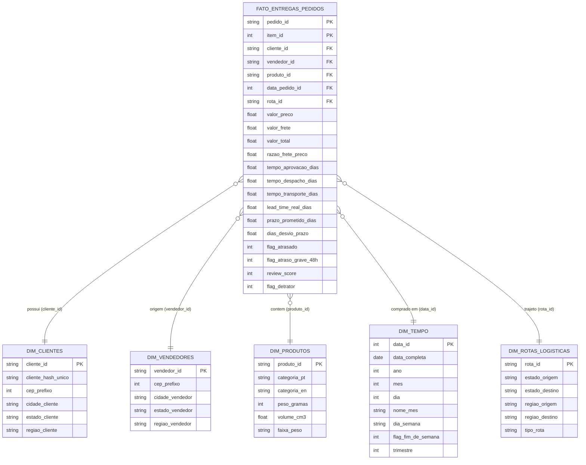

# Modelagem Dimensional — Data Warehouse & Lakehouse (Olist E-Commerce)

## 1. Visão Geral da Arquitetura
Para responder às perguntas de negócio com alto desempenho analítico, escalabilidade e clareza semântica, adotou-se a **Modelagem Dimensional (Esquema Estrela / Star Schema)**, consagrada pela metodologia de Ralph Kimball.

No ambiente de nuvem (**Databricks / Delta Lake**), a arquitetura organiza-se no padrão **Medalhão (Medallion Architecture)**:
1. **Camada Bronze (Raw/Staging):** Ingestão fiel dos dados brutos em formato CSV/Delta sem transformações destrutivas.
2. **Camada Silver (Conformed/Cleaned):** Tabelas limpas, tipadas, deduplicadas, com chaves consistentes e valores faltantes tratados.
3. **Camada Gold (Dimensional/Analytics):** Tabelas Fato e Dimensões estruturadas em Esquema Estrela, otimizadas para consultas SQL e visualizações gerenciais.

---

## 2. Diagrama Entidade-Relacionamento Dimensional (Star Schema)

---

## 3. Descrição da Tabela Fato e Dimensões

### 3.1 Tabela Fato: `fato_entregas_pedidos`
* **Granularidade:** Um registro por item de pedido entregue ao cliente final.
* **Métricas Principais (Fatos):**
  * `valor_preco`: Preço nominal do item em Reais (BRL).
  * `valor_frete`: Custo rateado de transporte logístico do item (BRL).
  * `valor_total`: `valor_preco + valor_frete`.
  * `razao_frete_preco`: Proporção do frete sobre o preço ($\frac{\text{frete}}{\text{preço}}$) — mede o peso do frete na decisão de compra.
  * `tempo_despacho_dias`: Intervalo entre a aprovação do pedido e o envio à transportadora.
  * `tempo_transporte_dias`: Intervalo entre a coleta pela transportadora e a entrega ao destinatário.
  * `lead_time_real_dias`: Tempo total do ciclo do pedido (da compra à entrega física).
  * `prazo_prometido_dias`: Tempo estimado de entrega informado pela plataforma no momento da compra.
  * `dias_desvio_prazo`: Diferença $(\text{Data Entrega Real} - \text{Data Prometida})$. Valores positivos indicam atraso real.
  * `flag_atrasado`: Variável booleana/binária (1 = Entrega realizada após a data estimada; 0 = No prazo).
  * `flag_atraso_grave_48h`: Indicador de atraso superior a 48 horas (2 dias).
  * `review_score`: Nota de avaliação do cliente (escala ordinal de 1 a 5).
  * `flag_detrator`: Cliente insatisfeito (score $\le 2$).

### 3.2 Dimensão Clientes: `dim_clientes`
* Identificação geográfica do consumidor final.
* Permite estratificar as análises pelas 5 Macrorregiões do Brasil (Norte, Nordeste, Centro-Oeste, Sudeste, Sul) e 27 Unidades Federativas.

### 3.3 Dimensão Vendedores: `dim_vendedores`
* Mapeamento da localização do lojista/parceiro da Olist.
* Permite confrontar a concentração da oferta no Sudeste/Sul com a capilaridade da demanda nacional.

### 3.4 Dimensão Produtos: `dim_produtos`
* Características físicas e taxonômicas do catálogo de mercadorias.
* Categorias traduzidas para português e inglês.
* Atributos calculados: `volume_cm3` ($Comprimento \times Altura \times Largura$) e classificação em `faixa_peso` (Leve, Médio, Pesado, Muito Pesado).

### 3.5 Dimensão Tempo: `dim_tempo`
* Calendário contínuo que cobre o ciclo temporal dos pedidos (2016 a 2018).
* Suporta recortes sazonais por ano, mês, dia do mês, dia da semana e dias úteis.

### 3.6 Dimensão Rotas Logísticas: `dim_rotas_logisticas`
* Modela o vetor logístico $(\text{Origem} \rightarrow \text{Destino})$.
* Classificação em três modalidades:
  1. `Intraestadual`: Vendedor e cliente no mesmo estado.
  2. `Interestadual (Mesma Região)`: Estados vizinhos dentro do mesmo bloco geográfico (ex.: SP para RJ, PR para SC).
  3. `Inter-regional`: Longa distância cruzando blocos geográficos (ex.: SP para BA, RS para AM).
